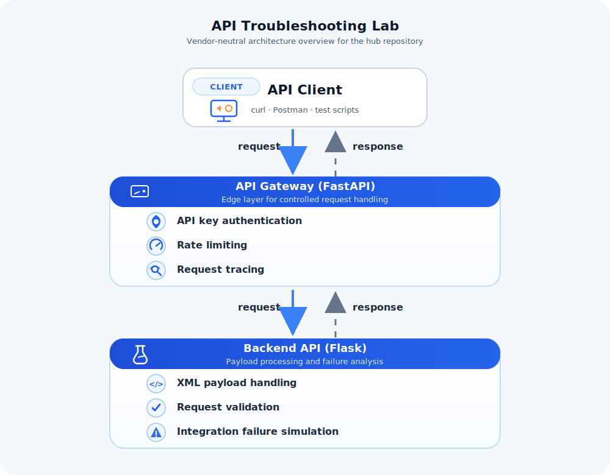

# API Troubleshooting Lab

A multi-service troubleshooting lab built with a FastAPI gateway and Flask backend to replicate the kind of API issues that show up in real environments: authentication failures, rate limiting, malformed payloads, upstream errors, timeouts, request tracing gaps, and the need to prove behaviour with tests rather than assumptions.

This repository is the **hub** for the project. It ties together the gateway and backend services, explains the architecture, and gives a single entry point for understanding how the lab works.

## Why I built this

A lot of API projects only show the happy path. That is not how production systems behave.

I built this lab to demonstrate practical troubleshooting across service boundaries:

- following a request from entry point to backend response
- distinguishing gateway issues from backend issues
- reproducing failures intentionally instead of waiting for them to happen by chance
- validating behaviour with automated tests
- making debugging easier with structured logs and request IDs

## Architecture



### Request flow

```text
Client
  │
  ▼
API Gateway (FastAPI)
  │
  ▼
Backend API (Flask)
  │
  ▼
Response
```

## Repositories

This project is intentionally split into separate repositories to reflect a more realistic service layout.

| Repository | Purpose |
|---|---|
| **api-troubleshooting-lab** | Hub repository for architecture, overview, and shared documentation |
| **api-troubleshooting-lab-gateway** | FastAPI gateway handling authentication, rate limiting, request forwarding, and upstream error handling |
| **api-troubleshooting-lab-backend** | Flask backend handling XML validation, order processing, failure simulation, and trace-aware responses |

- Gateway service: [api-troubleshooting-lab-gateway](https://github.com/GregoryCarberry/api-troubleshooting-lab-gateway)
- Backend service: [api-troubleshooting-lab-backend](https://github.com/GregoryCarberry/api-troubleshooting-lab-backend)

## Quick start

To run the full system locally:

1. clone both repositories:
   - gateway: [api-troubleshooting-lab-gateway](https://github.com/GregoryCarberry/api-troubleshooting-lab-gateway)
   - backend: [api-troubleshooting-lab-backend](https://github.com/GregoryCarberry/api-troubleshooting-lab-backend)

2. start the backend service

3. start the gateway service

4. send requests via Postman using the collection in the gateway repository

Default:
- gateway runs on `http://127.0.0.1:8000`
- API key: `lab-demo-key`

See the gateway repository for full setup instructions and Postman collection.

## What the system demonstrates

### Gateway concerns

The gateway acts as the control layer in front of the backend. It is responsible for:

- API key authentication
- rate limiting
- request ID generation and propagation
- proxying requests to the backend
- converting upstream failures into appropriate client responses
- structured logging for request-level observability

### Backend concerns

The backend handles application logic and failure simulation. It is responsible for:

- XML request handling
- validation of structure and values
- in-memory order storage for repeatable testing
- simulated failure modes for troubleshooting exercises
- returning consistent trace headers in responses
- structured logging tied to the same request ID used by the gateway

## Failure scenarios covered

This lab is built around situations that are actually useful to debug.

### Gateway-side issues

- missing API key
- invalid API key
- rate limit exceeded
- backend unavailable
- backend timeout

### Backend-side issues

- malformed XML
- missing fields
- invalid values
- unsupported content type
- simulated dependency failure
- simulated timeout
- simulated internal exception
- not found responses for missing orders

## Observability

The project uses two simple but effective observability patterns:

### Structured JSON logging

Both services emit structured logs to make request analysis easier and reduce noisy, unhelpful output.

### `X-Request-ID` tracing

A request ID is generated at the gateway if one is not already present, forwarded to the backend, included in response headers, and written into both services' logs.

That makes it possible to correlate one request across the full path:

```text
client → gateway log → backend log → response header
```

## Testing

Both service repositories include test coverage.

The tests cover:

- success paths
- validation failures
- injected failure modes
- request tracing behaviour
- gateway to backend behaviour

This matters because the project does not rely on manual checking alone. Expected behaviour is verified.

## Typical troubleshooting workflow

A typical investigation in this lab looks like this:

1. send a request through the gateway
2. inspect the returned status and `X-Request-ID`
3. check gateway logs for authentication, routing, or upstream handling
4. check backend logs for payload validation or simulated service failures
5. confirm the issue source and reproduce it with a controlled test case

That workflow is the real value of the project.


## Skills demonstrated

- API troubleshooting
- HTTP status code analysis
- FastAPI and Flask
- request tracing across service boundaries
- structured JSON logging
- pytest-based testing
- controlled failure simulation
- gateway and backend debugging
- Postman-based API testing
- clear technical documentation

## Repository layout

```text
api-troubleshooting-lab/
├── diagrams/
│   └── api-troubleshooting-lab-architecture.svg
├── docs/
├── screenshots/
└── README.md
```

## Who this project is for

This project is aimed at:

- technical support and service desk roles
- cloud support roles
- junior platform or DevOps roles
- anyone who needs to show they can debug systems rather than just build endpoints

## Current state

The lab is already in a strong state:

- multi-service architecture is working
- request tracing is implemented end to end
- structured logging is in place
- failure simulation works
- tests exist across both services
- READMEs for gateway and backend are already aligned

## Next stage

The next presentation improvements for this project are:

- confirm the Postman collection is clean, reusable, and easy to demo
- add screenshots showing successful requests, failure responses, logs, and test output
- integrate the project into my portfolio with a clear problem → solution → proof narrative
- write a LinkedIn post built around troubleshooting, observability, and test-backed debugging

## License

This project is provided for educational and portfolio purposes.
